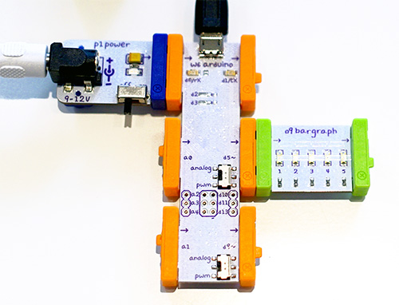

# LittleBits, Blink LED When Somebody Tweets [...]

By Tomomi Imura ([@girlie_mac][twitter])

A simple demo with LittleBits in node.js using Johnny-Five, which notifies you when somebody tweeted with certain queries by blinking LED.

### What is LittleBits?

[LittleBits][littlebits] is a open source library of electric modules that you can snap together with magnets. There are over 60 Lego-like modules and more than 150,000 possible circuit combinations to play with.

### Communicate LittleBits with Arduino using Node.js

I am using [Johnny-Five][j5], an Open Source, Firmata Protocol based, IoT and Robotics programming framework for Node.js, developred by Rick Waldron.

Anna Gerber gathered all information and sample code to get started with [programming LittleBits with Jonny-Five][anna].

### PubNub Twitter Firehose

This demo uses [PubNub Twitter data stream][firehose].

## Assembling LittleBits

Connect Arduino to your machine, and turn the power on.

## Running this Demo

You need to run this demo on your own machine. Make sure your machine has [Node.js][node] installed.

1. Fork or download this repo to your local machine.
2. Install dependencies: `$ npm install`
3. Run code: `$ node index.js`
4. Open the web client at http://localhost:3000
5. Type some queries and hit Submit
6. Watch the action

## Tutorial

[Triggering littleBits LEDs with Node.js Using Johnny-Five](http://www.pubnub.com/blog/triggering-littlebits-leds-in-realtime-with-node-js-using-johnny-five/)
 
 
### Related Tutorial

PubNub ❤ Twitter Project

[Tweet emotion: real-time Tweet analysis with PubNub Data Stream](https://blog.twitter.com/2014/tweet-emotion-real-time-tweet-analysis-with-pubnub-data-stream) on blog.twitter.com

This explains how to use PubNub's Twitter Firehose!

[twitter]: http://twitter.com/girlie_mac
[j5]: https://github.com/rwaldron/johnny-five
[anna]: https://github.com/AnnaGerber/little-bits-js
[littlebits]: http://littlebits.cc/
[node]: https://nodejs.org/
[firehose]: http://www.pubnub.com/developers/data-streams/twitter-stream
